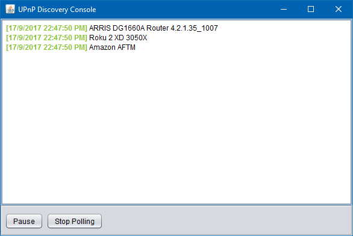

# UPnPMapper
Discover universal plug and play devices on your local network.

This project was inspired by the [PortMiner project](https://github.com/smithy212000/PortMiner). I first wanted to see if I had any UPnP devices that I could leverage in order to host a Minecraft server with `zeroconf` port forwarding.

### Running the App

A binary is available to quickly get started. It may be downloaded here: [Archived JAR](https://github.com/gkhays/UPnPMapper/files/1309619/UpnPMapper.zip).

Once the archive has been downloaded, extract it to a location of your choice. Then double-click on the JAR file -- it is an executable, self-contained JAR.

So far, I have only tested on Windows.

Contains LGPL software from: https://github.com/4thline/cling.
